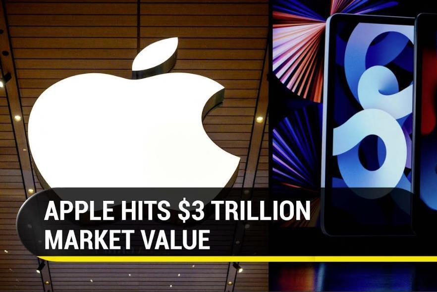
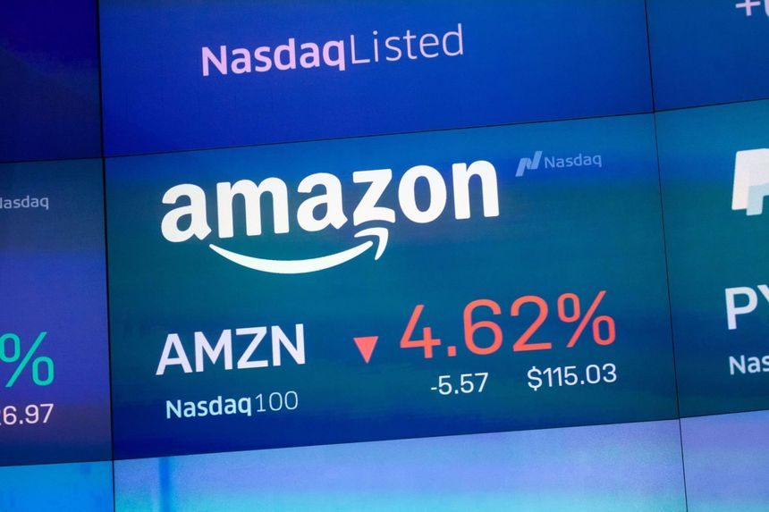

```{r setup, include=FALSE}
library(flexdashboard)
library(shiny)
library(tidyverse)
library(here)
library(DT)
library(usmap)
library(showtext)
showtext_auto()
```

# About

## Column {data-width=350}
-----------------------------------------------------------------------

### **Purpose**

This dashboard was created to investigate how did the stock prices of five tech companies (Apple, Amazon, Alphabet, Meta, and Microsoft) change over time from 2010 to 2022.

### **Data source**

The original data come from [Yahoo Finance](https://stackoverflow.com/questions/56024713/how-to-use-gganimate-package-plot-a-dynamic-map-in-r), which provides historical stock data for various companies. The data was scraped and cleaned by [Ryo Nakagawara](https://anderfernandez.com/en/blog/how-to-create-animations-in-r-with-gganimate/) and posted on [Kaggle](https://www.kaggle.com/datasets/evangower/big-tech-stock-prices/).

### **Author**

This dashboard was made by Yujia Yan.


# Data

## Column {data-width=650}
-----------------------------------------------------------------------

### **Data source**

The original data come from [Yahoo Finance](https://stackoverflow.com/questions/56024713/how-to-use-gganimate-package-plot-a-dynamic-map-in-r), which provides historical stock data for various companies. The data was scraped and cleaned by [Ryo Nakagawara](https://anderfernandez.com/en/blog/how-to-create-animations-in-r-with-gganimate/) and posted on [Kaggle](https://www.kaggle.com/datasets/evangower/big-tech-stock-prices/).

### **Data dictionary**

| Variable | Description |
| -------- | ----------- |
| stock_symbol | stock_symbol |
| date | date |
| open | The price at market open. |
| high | The highest price for that day. |
| low | The lowest price for that day. |
| close | The price at market close, adjusted for splits. |
| adj_close |	double |	The closing price after adjustments for all applicable splits and dividend distributions. Data is adjusted using appropriate split and dividend multipliers, adhering to Center for Research in Security Prices (CRSP) standards. |
| volume | The number of shares traded on that day. |

<details>
  <summary>Click to show or hide code</summary>
```{r}
tuesdata <- tidytuesdayR::tt_load('2023-02-07')
tuesdata <- tidytuesdayR::tt_load(2023, week = 6)

big_tech_stock_prices <- tuesdata$big_tech_stock_prices
big_tech_companies <- tuesdata$big_tech_companies
```

### **Data table** {data-height="870"}
```{r}
show <- big_tech_stock_prices[, c("stock_symbol","date","open","high","low","close","adj_close","volume")] %>% 
  arrange(stock_symbol) %>% 
  head(100) %>% 
  setNames(c('Company','Date','Open','High','Low','Close','adj_close','volume')) 

renderDataTable({
  datatable(show)})
```

# Stock price over time 

## Column {.sidebar}

```{r}
sliderInput("slider", "Year range", min = 2010, max = 2022, value = c(2010, 2022))
```

## Column
```{r}
big_tech_stock_prices <- big_tech_stock_prices %>%
  filter(stock_symbol %in% c("AAPL", "AMZN", "GOOGL", "MSFT", "TSLA"))
```

```{r}
big_tech_stock_prices <- big_tech_stock_prices %>%
  mutate(date = as.Date(date))
```

```{r}
filtered_data <- reactive({
    big_tech_stock_prices %>%
      filter(date >= input$slider[1] & date <= input$slider[2]) %>%
      group_by(date) %>%
      count()
})
renderPlot({
  ggplot(filtered_data(), aes(x = date, y = close, color = stock_symbol)) +
    geom_line() +
    scale_y_continuous(labels = scales::dollar_format()) +
    labs(title = "Stock price over time for each company",
        subtitle = "Data source: Yahoo Finance via Kaggle",
        x = "Date",
        y = "Stock price (USD)")
})
```

# Percentage change in stock price

## Column
```{r}
big_tech_stock_prices <- big_tech_stock_prices %>%
  group_by(stock_symbol) %>%
  mutate(pct_change = (close - lag(close)) / lag(close) * 100) %>%
  ungroup()
```

```{r}
p2 <- ggplot(big_tech_stock_prices, aes(x = date, y = pct_change, color = stock_symbol)) +
  geom_line() +
  scale_y_continuous(labels = scales::percent_format()) +
  labs(title = "Percentage change in stock price over time",
       subtitle = "Data source: Yahoo Finance via Kaggle",
       x = "Date",
       y = "Percentage change",
       color = "Company")
print(p2)
```

# Stock price distribution 
## Column {.tabset} 
### **Company**




### **stock price distribution for each company by year**
```{r}
p3 <- ggplot(big_tech_stock_prices, aes(x = close, fill = stock_symbol)) +
  geom_density(alpha = 0.7) +
  scale_x_continuous(labels = scales::dollar_format()) +
  facet_wrap(~year(date)) +
  labs(title = "Stock price distribution by year",
       subtitle = "Data source: Yahoo Finance via Kaggle",
       x = "Stock price (USD)",
       y = "Density",
       fill = "Company")
print(p3)
```

# Stock price over time 

## Column {.sidebar}

```{r}
sliderInput("slider", "Year range", min = 2010, max = 2022, value = c(2010, 2022))
```

## Column

```{r}
big_tech_stock_prices <- big_tech_stock_prices %>%
  mutate(sector = case_when(
    stock_symbol %in% c("AAPL", "MSFT") ~ "Technology",
    stock_symbol %in% c("AMZN", "GOOGL") ~ "Communication Services",
    stock_symbol == "TSLA" ~ "Consumer Discretionary"
  ))
p4 <- ggplot(big_tech_stock_prices, aes(x = volume, y = close, color = stock_symbol)) +
  geom_point() +
  scale_x_log10(labels = scales::comma_format()) +
  scale_y_continuous(labels = scales::dollar_format()) +
  labs(title = "Closing price vs volume of big tech stocks as of 2023-02-07",
       subtitle = "Data from Kaggle",
       x = "Volume (log scale)",
       y = "Closing price (USD)",
       color = "Company") +
  facet_wrap(~ sector)

print(p4)
```

# Analysis
## Column

**Filter the stocks data to keep only the five companies of interest**
```{r}
big_tech_stock_prices <- big_tech_stock_prices %>%
  filter(stock_symbol %in% c("AAPL", "AMZN", "GOOGL", "MSFT", "TSLA"))
```

```{r}
big_tech_stock_prices <- big_tech_stock_prices %>%
  mutate(date = as.Date(date))
```

**Plot the stock price over time for each company**
```{r}
p1 <- ggplot(big_tech_stock_prices, aes(x = date, y = close, color = stock_symbol)) +
  geom_line() +
  scale_y_continuous(labels = scales::dollar_format()) +
  labs(title = "Stock price over time",
       subtitle = "Data source: Yahoo Finance via Kaggle",
       x = "Date",
       y = "Stock price (USD)",
       color = "Company")
print(p1)
```

```{r}
# Create a point plot of closing price vs volume for each company, faceted by sector
big_tech_stock_prices <- big_tech_stock_prices %>%
  mutate(sector = case_when(
    stock_symbol %in% c("AAPL", "MSFT") ~ "Technology",
    stock_symbol %in% c("AMZN", "GOOGL") ~ "Communication Services",
    stock_symbol == "TSLA" ~ "Consumer Discretionary"
  ))
p4 <- ggplot(big_tech_stock_prices, aes(x = volume, y = close, color = stock_symbol)) +
  geom_point() +
  scale_x_log10(labels = scales::comma_format()) +
  scale_y_continuous(labels = scales::dollar_format()) +
  labs(title = "Closing price vs volume of big tech stocks as of 2023-02-07",
       subtitle = "Data from Kaggle",
       x = "Volume (log scale)",
       y = "Closing price (USD)",
       color = "Company") +
  facet_wrap(~ sector)

print(p4)
```

**Conclusion**

The plots show that the stock prices of the five big tech companies increased over time, with some fluctuations and drops. After 2020, the stock prices of these companies have increased significantly.
